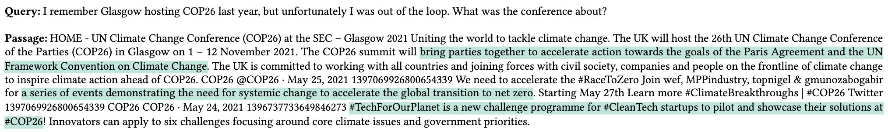

# Towards Filling the Gap in Conversational Search: From Passage Retrieval to Conversational Response Generation

## Summary

Research on conversational search has so far mostly focused on query rewriting and multi-stage passage retrieval. However, synthesizing the top retrieved passages into a complete, relevant, and concise response is still an open challenge. Having snippet-level annotations of relevant passages would enable both (1) the training of response generation models that are able to ground answers in actual statements and (2) automatic evaluation of the generated responses in terms of completeness. In this paper, we address the problem of collecting high-quality snippet-level answer annotations for two of the TREC Conversational Assistance track datasets. To ensure quality, we first perform a preliminary annotation study, employing different task designs, crowdsourcing platforms, and workers with different qualifications. Based on the outcomes of this study, we refine our annotation protocol before proceeding with the full-scale data collection. Overall, we gather annotations for 1.8k question-paragraph pairs, each annotated by three independent crowd workers. The process of collecting data at this magnitude also led to multiple insights about the problem that can inform the design of future response-generation methods.

## Crowdsourcing task design

The crowdsourcing task designs and the automatic quality control mechanisms are covered in detail [here](crowdsourcing_task_design/README.md). 

## Annotated data

The annotated data for every task configuration considered in the paper is covered in detail [here](data/README.md). 

## Evaluation measures

The implementation of similarity measures, both for inter-annotator agreement as well as for agreement between crowd workers and expert annotators, can be found [here](snippet_annotation/measures/). To generate the result tables presented in the paper run the following command:

``
python -m snippet_annotation.create_result_tables
``
