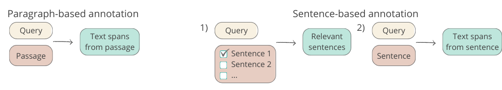

# Crowdsourcing tasks

## Preliminary study

### Task design

We experiment with two different designs of snippet annotation crowdsourcing task: paragraph-based and sentence-based.

In paragraph-based annotation task workers are asked to identify all text snippets relevant to the query in a single passage. The paragraph-based task variant is run both on [Amazon MTurk](mturk_paragraph-based.png) and on [Prolific](prolific_task.png). The only difference in the task design is that workers on Prolific are presented with one passage per turn for the whole topic at once. While workers on MTurk annotate each turn-passage pair individually. 

Given that paragraphs can be lengthy, we consider a sentence-based variant of the annotation task in order to simplify the task and let workers operate on significantly shorter text. Specifically, the annotation task is divided into two subtasks: (1) relevant sentence selection and (2) snippet annotation in relevant sentences. In [subtask 1](mturk_sentence-based_subtask-1.png), crowd workers are presented with a question and a passage split into sentences. They are asked to choose sentences that contain information relevant to the query. The task is very straightforward and resembles extractive summarization. [Subtask 2](mturk_sentence-based_subtask-2.png) is very similar to the paragraph-based annotation task, the only difference being that workers are presented with a relevant sentence instead of a whole passage.

### Task configurations

The paragraph-based annotation task, which is regarded as the cognitively more demanding variant, is performed with workers from both crowdsourcing platforms as well as with expert annotators. The sentence-based variant of the task is executed only on MTurk. All tasks on MTurk are performed with both regular and master workers. 
The remuneration varies depending on the platform used, with payments on MTurk ensuring that the payment is above the US federal minimum wage and on Prolific being determined by the recommended payment per minute suggested on the platform. The reported numbers correspond to the average cost of annotating one paragraph (based on the avg. number of sentences per paragraph in the case of the sentence-based variant) and also include the platform fee. 
The table presented below reports on the number of workers assigned for each sample in the given task variant, the median time taken to annotate a paragraph, and the acceptance rate after a manual quality check. The acceptance rate is given only to tentatively present the difficulty of different variants of the task and it is not indicative of the quality of the final accepted annotations. The quality check has been performed by a single author of the paper, therefore the acceptance rate is prone to the natural bias of the evaluator.

| Task Variant | Annotator | Time | # workers | Acceptance rate | Cost |
| --- | --- | --- | --- | --- | --- |
| Paragraph | MTurk regular | 182s | 5 | 50% | $0.36 |
| Paragraph  | MTurk master | 63s | 5 | 90% | $0.38 |
| Paragraph | Prolific | 154s | 5 | 79% | $0.51 |
| Paragraph | Expert | 96s | 3 | - | - |
| Sentence | MTurk regular | 977s | 3 | 72% | $0.43 |
| Sentence | MTurk master | 305s | 3 | 87% | $0.56 |

The overall cost of preliminary study was ~$1.2k. The large-scale data collection cost ~$2.1k with ~1.7k corresponding to crowd workers rewards, ~$300 for MTurk fees, and $200 for bonuses.

### Quality control

Text snippets are required to be short, concise, informative, self-contained, and cannot overlap. Each snippet is supposed to contain one piece of information, so it can be treated as an information nugget. In order to ensure the highest quality of the collected data, we define several automatic quality control criteria before the final manual verification of results. In the paragraph-based task, annotations longer than 50% of the passage and annotations not contained in the intersection of the intervals chosen by at least two other crowd workers are flagged. In the first subtask of the sentence-based variant, we flag submissions where fewer than one sentence or more than 75% sentences are chosen. Additionally, only assignments that have at least one common sentence chosen with other crowd workers are accepted. The second part of the sentence-based snippet annotation task applies quality control criteria similar to paragraph-based ones with a maximum length of the snippet increased to 75% of the sentence. The automatic quality control criteria are only used to flag submissions that require additional attention. All results are manually verified by one of the authors of the paper. Responses not in accordance with task requirements are rejected.

## Large-scale data collection setup

The crowdsourcing tasks for TREC CAsT'20 and '22 datasets were released on Amazon MTurk only for a small group of trained crowdworkers. The [qualification task](large_scale_data_collection-qualification_task.pdf) has been completed by 20 MTurk workers with the results manually verified by experts. From the 20 workers that completed the qualification task, we chose 15 that provided results of the highest quality. Each worker received feedback on the provided responses and additional questions if needed. Several rounds of discussion that emerged from the qualification task resulted in [extended guidelines](large_scale_data_collection-updated_guidelines.pdf) with additional points addressing the challenging aspects identified in the annotation task. The process of data collection was divided into batches. Every worker was given one batch containing 25-85 question-passage pairs every day for almost two weeks. The number of HITs released differed between the workers every day, but the overall amount of assigned HITs was almost the same for everyone (approximately 46 HITs every day). Each batch was annotated by 3 different workers and contained questions about one specific topic which made the annotations easier. The task design is the same as the paragraph-based task variant run on [Amazon MTurk](mturk_paragraph-based.png) in the preliminary study on two topics.